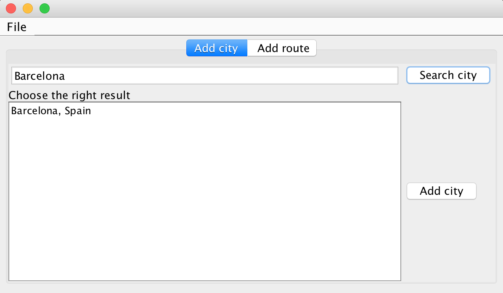
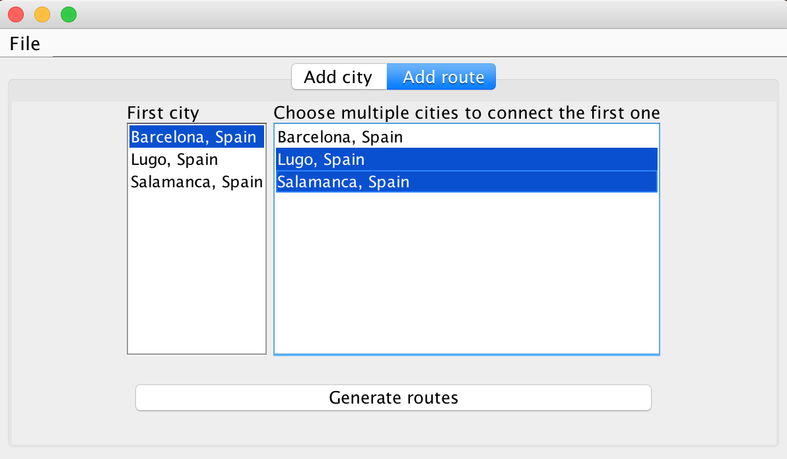

# README

### Cities Graph Generator
#### Version 1.0

## Introduction

This project allows any user to get basic information of any existing city 
and calculate routes by car between two of them using the Google Maps API Web Services.
 
The interaction with this software can be done using the provided graphic interface
implemented in Swing.

## Purpose of the project

This software has been done with the objective to create a simple and attractive 
graph model of cities and routes. The "base model" generated with this tool can be used 
for academic purposes in Algorithms or Data Structure subjects. For example, to request
the students the implementation of a graph of cities in any language as well as the 
implementation of different Combinatorial algorithms to find the most optimal route
between two given cities.

Also, the project may be helpful for those who are not familiar with JSON, MVC pattern
or accessing Web Services.

## Data Model

As explained above, you can get information of cities as well as connect them 
by car. This data can be imported and/or exported in JSON format. An example is 
provided below:

```json
{
  "cities": [
    {
      "name": "Barcelona",
      "address": "Barcelona, Spain",
      "country": "ES",
      "latitude": 41.3850639,
      "longitude": 2.1734035
    },
    {
      "name": "Madrid",
      "address": "Madrid, Spain",
      "country": "ES",
      "latitude": 40.4167754,
      "longitude": -3.7037902
    },
    {
      "name": "Málaga",
      "address": "Málaga, Spain",
      "country": "ES",
      "latitude": 36.7212737,
      "longitude": -4.4213988
    }
  ],
  "connections": [
    {
      "city1": "Barcelona",
      "city2": "Madrid",
      "distance": 623866,
      "duration": 21734
    },
    {
      "city1": "Madrid",
      "city2": "Málaga",
      "distance": 528784,
      "duration": 18812
    },
    {
      "city1": "Barcelona",
      "city2": "Málaga",
      "distance": 968261,
      "duration": 33961
    }
  ]
}
```

**Distance value** is expressed in meters and the **route duration** is expressed in seconds.

## GUI

A brief explanation of the GUI is described here. There are two main views,
the first one allows the user to add cities and the second one calculate 
routes between cities already searched and added to the system.

### Add city


You can write the name of any city and, if a result is found, select the correct 
one (the name of the city can exist in different countries) and add it.

### Add route


On the left panel you can select one city as origin, on the right one you are able
to choose all the cities to connect from the first one.

### File Menu

The menu allows the user to save the current data obtained as well as import
existing JSON files to the system. 

## Download

You can ```clone``` the project or import it using Maven.

```xml
<project xmlns="http://maven.apache.org/POM/4.0.0"
         xmlns:xsi="http://www.w3.org/2001/XMLSchema-instance"
         xsi:schemaLocation="http://maven.apache.org/POM/4.0.0 http://maven.apache.org/xsd/maven-4.0.0.xsd">
    <modelVersion>4.0.0</modelVersion>

    <groupId>com.albertpv.app</groupId>
    <artifactId>CitiesGraphGenerator</artifactId>
    <version>1.0</version>

</project>
```